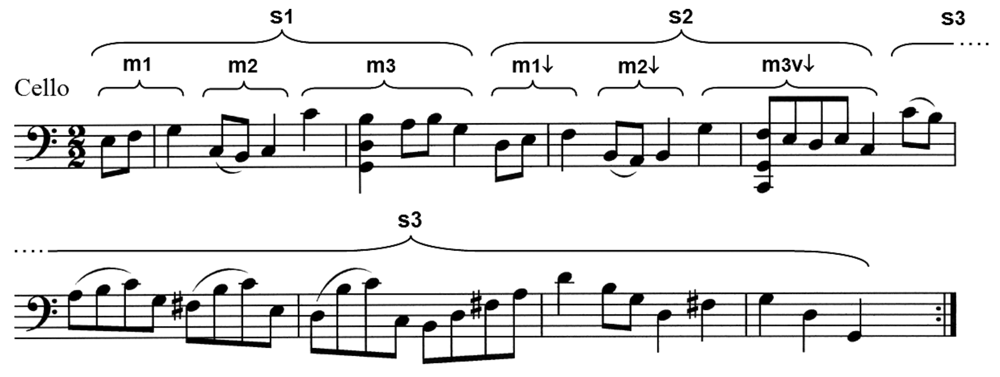
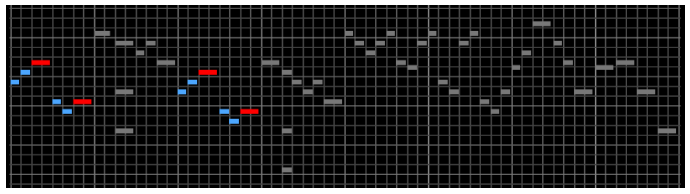
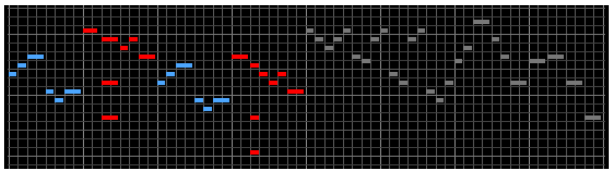
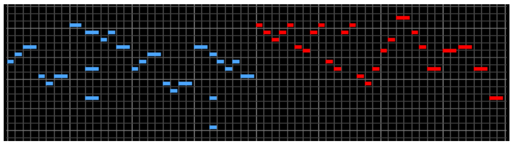

---
header-includes:
    - \usepackage{amsmath}
    - \usepackage{amssymb}
    - \usepackage{xfrac}
    - \usepackage{wasysym}
    - \usepackage{harmony}
---
<!--
present a 20-25 minutes slide or power point presentation that will be judged by
the rest of the class, the instructor and other faculty members that will attend
the presentations.

The teams must also submit a formal project (very much in the style of a journal
publication). The report should not exceed 20 pages (including all graphic
material) and should include:
- Title, authors, affiliations.
- Abstract.
- Introductory background material on the literature and significance of the
  project.
- Development of the mathematical model or a survey of a collection of relevant
  models.
- Discussion on the relevant mathematical theory that applies.
- Some original work on your own for either extending the model and performing
  simulations.
- Discussion and conclusions to summarize your work.
- References.

-->

# Abstract

Music and mathematics are two subjects more related to one-another than most
people know. A single melody can be thought of as a sequence of changing pitch
frequency intervals, along side a sequence of rhythmic durations. In this
project we will first explore ways in which to translate musical melodies into
real-valued numerical sequences, and second we will study these sequences by
applying familiar fractal dimension metrics in an attempt to explore fractal
patterns in music and build insight into what "fractal music" really means.

---

# Introduction

Out of principle we must begin our discussion on fractals in music by mentioning
the late Benoit Mandelbrot. Mandelbrot coined the phrase “fractal” in 1975 to
describe objects that retained complexity and detail, at different scales;
similar to how the photograph of a pile of rocks can look similar to the picture
of a mountain, if there is nothing to provide a sense of scale{MIT}. Initially,
Mandelbrot observed this in time series graphs of product prices in the economy,
where if there was no scale it would be impossible to tell if the price changes
were updated per minute, hour, day, etc. {MIT}. Mandelbrot also tended to speak
of “roughness”{TED}. Something that was smooth would be akin to time series plot
that looked like a smooth curve. A rough graph would look like a plot with many
dynamic changes.  

<!-- SECTION ------------------------------------------------------------- -->
# A primer on music

## Pitch, notes, rhythm

## Intervals and melody

<!-- SECTION ------------------------------------------------------------- -->

<!--
- Talk about how Mandelbrot was interested in music
- How Brothers was tasked to study scaling?
-->

Mandelbrot believed in the power of the human eye to notice “roughness”
{MIT}{TED}, but music provides a unique challenge, because in the moment, music
is felt in a psychological sense, and is usually not observed as a whole, unless
one acquires sheet music or other physical interpretation of the music as a
composer intended. In fact, in the memoir book for Mandelbrot A life in Many
Dimensions, Harlan Brothers wrote, “Benoit Mandelbrot always had a strong
feeling that music could be viewed from a fractal perspective. However, without
our eyes to guide us, how do we gain this perspective?”{ALMD} The question posed
is an excellent one, and Brothers goes on to discuss that generally there are
seven ways that fractals can appear in music.

## Misconceptions

Before we discuss these seven ways, we would like to mention that there are
several misconceptions as to what fractal music is, which Brothers discusses on
his webpage{Brothers}. The most common misconception is that converting fractal
images into sound produces fractal music. In many cases these transformations
can hardly be classified as music and simply as noise. Another misconception is
to think that iterations always cause fractals in music. This is not true in the
physical sense as the lodistic map illustrates {Brothers} and it does not hold
in music either. The last misconception that Brothers talks about in regards to
fractal music is that of self similarity. As with fractal diagrams, self
similarity is a necessary but no sufficient condition{Brothers}. He gives the
example that, “ onions, spirals, and Russian dolls are not fractal; they do not
contain a minimum of two matching or similar regions in which the arrangement of
elements either mirrors or imitates the structure of the object as a whole.” So,
it is necessary that parts of a musical piece be similar to larger sections of
the musical composition. 

<!-- SECTION ------------------------------------------------------------- -->
# A primer on music

Before introducing the different ways in which fractal patterns arise in music
it is essential that some basic building-blocks of music be introduced.

## Pitch, intervals, and rhythm

A single key on a piano, when struck, produces a single pitch. Pitch is one of
the most fundamental properties of notes in music, but what exactly
is pitch? The sound that is produced by the piano is really the combination of
several strings vibrating, each producing different frequencies of sound.
Together this combination forms the characteristic sound of the piano (also
called timbre, the specific quality to the sound of, in this case, the piano). 
The strongest frequency in this collection is called the fundamental frequency
of the "note" being played, and to this frequency a name is assigned. In the
case of a piano, and of all Western music, these frequency names come from the
alphabet: A, B, C, D, E, F, and G. Though pitches are unique unto their
frequency, some pitches are considered equivalent with respect to the ratio of
their frequencies. For example, the pitch A4 (concert A) sounds at 440 cycles
per second (hertz), while A5 sounds at 880 hertz: a ratio of 1:2.
This ratio is called an octave, and thus we have names for distances between
frequencies which we call \emph{intervals}. Within Western music notation there
are a finite number of named intervals; here's a few: perfect octaves, perfect
fifths, diminished fifths, augmented fourths (equivalent to diminished fifths),
major thirds, minor thirds, etc. Between any two notes (and even between a note
and itself) there is an interval between them. (These intervals between notes
are the concern of a later section of this paper.)
Back to octaves:
despite having
unique frequencies, any two pitches which are an interval of an octave apart (or
multiple octaves apart, e.g. C2 and C5) from one another, are considered
equivalent.
Lastly,
If you are familiar with the piano then you will know there are actually are
more than seven keys in between octaves, twelve precisely. These are just
smaller subdivisions of the frequency ranges between octaves.

The other most fundamental property of notes is duration, also called rhythmic
value (or just value). Music as listened to is inherently ephemeral: in the
moments in which we experience music by listening to it, it exists, but then it
is gone. How long we experience the sound of a pitch is called its duration,
and we might measure the duration of a pitch by how long it is played in
seconds. 
Establishing a baseline duration is important in the composition of music; some
pieces of music consist of pitches that are long in duration, while others
consist of pitches that exist only for a split-second. But not all pitches need
have the same duration, and so we have rhythm: the ratios between pitches in
terms of duration. For example we might play one pitch for twice as long as the
one before, and then next two pitches for a quarter as long.
Like with pitch, different rhythmic values also have names within Western music
notation, some of the most basic of which being whole notes $\Ganz$, half notes
$\Halb$, quarter notes $\Vier$, and eighth notes $\Acht$. Notice that the names
all have to do with fractions. A piece of music might set a baseline speed by
stating that the duration of a quarter note should be a certain number of
seconds---then the duration of a half note would be twice as long as the
duration of the quarter note, a whole note four times as long, an eighth note
half as long, a sixteenth note a quart as long, etc.

It is these two fundamental properties that are a part of every note in a piece
of music.

## Intervals, melody and harmony

<!-- SECTION ------------------------------------------------------------- -->
## Self-similarity scaling in music[^1]

As a subject of research, fractals and self-similarity in music may be fairly
niche, but there is no shortage of literature, new or old. One of the earliest
attempts at mathematically quantifying musical self-similarity was conducted by
Richard Voss and John Clarke, and in 1975 they published the article "$\sfrac 1
f$ noise in music and speech". They concluded that, within genres of music, a
$\sfrac 1 f$ power-law scaling behavior is characteristic of musical components
for pieces in the genre (though they were specifically concerned with the
Baroque era compositions of J.S. Bach, or just "classical" in layman's terms).
<!-- -->
However, there may be many different ways in which measurable self-similarity
within music can manifest; chapter 7 of the Mandelbrot text, written by
Brothers, provides a few examples of how scaling within music has been
quantified:

1. *Duration scaling*: the distribution of durations for individual notes is
   self-similar within a piece,
2. *Pitch scaling*: the distribution of pitches is statistically self-similar,
3. *Melodic interval scaling*: the distribution of melodic intervals is
   self-similar,
4. *Melodic moment scaling*: the distribution of the changes in melodic
   intervals is stylistically self-similar,
5. *Harmonic interval scaling*: the distribution of harmonic intervals is
   self-similar,
6. *Structural scaling*: the structure of the music from a compositional
   standpoint relies on nested or recursive patterns, and
7. *Motivic scaling*: a motif, melodic or rhythmic, is repeated simultaneously
   at different time scales (called augmentation or diminution).

Brothers also cautions "it is important to note that, regardless of the type
of scaling under consideration, in order to fulfill a power law relation, any
inherent pattern in a group of musical elements requires the presence of a
minimum of three distinct levels of scaling. This requirement respects the fact
that the log-log plot of a power law relation appears linear; at least three
data points are needed to assert a linear relationship"[^2].

<!-- SECTION ------------------------------------------------------------- -->

# Fractal and multifractal dimension

<!-- SECTION ------------------------------------------------------------- -->

# Structural scaling and motivic scaling: Bach and fractals

There are many tales of Bach's impressive talents as a composer and virtuoso musician.A biographer of Bach's also recounts the time that Bach arrived to a town in Prussia as a stranger. Upon arrival King Frederick the Great invited him to the Royal Palace to try the new pianofortes. "After he had gone on for some time, he asked the King to give him a subject for a Fugue, in order to execute it immediately without any preparation."{H.T} Speaking about this same event, Douglas Hofstadter in his book Godel, Escher, Bach: An Eternal Golden Braid states, "the ten canons in the musical offering are among the most sophisticated canons Bach ever wrote. However, curiously enough, Bach himself never wrote them out in full. This was deliberate. They were posed as puzzles to King Frederick. It was a familiar musical game of the day to give a single theme, together with some more or less tricky hints, and to let the canon based on the theme be 'discovered' by someone else."{D.R} This shows that Bach truly incorporated math into his music and that his compositions were much more than a creative thought; that they contained a mathematical complexity that retained beauty. So, it is possible to see that his music contained fractal.

H.T. David and A. Mendel, The Bach Reader, pp.305-306.
D.R. Hofstadter, Godel, Escher, Bach: An Eternal Golden Braid (Basic Books, 1980).

Specifically, The first part of the fifth movement, the "Bourrée", from
Johann Sebastian Bach's Cello Suite No. 3 in C Major, BWV 1009.

The paper Structural Scaling of Bachs Cello Suite No.3 by Harlan Brothers is dedicated entirely to examining the scaling
characteristics within this single section of music, and the paper "Multifractal
analyses of music sequences" by Zhi-Yuan Su and Tzuyin Wu also takes a look at
this very same section (along with two other musical examples).

<!---->

<!-- LINK: https://www.youtube.com/watch?v=xR4IElye7eg -->

<!-- SECTION ------------------------------------------------------------- -->
# Pitch scaling: Stochastic composition

- Describe the procedure used to compose Guapos and Nils
- Analyze Guapos and Nils
- Expand on what pitch scaling is
- Describe how Guapos and Nils provides an example of pitch scaling fracticality

Stochasitc pitch scaling can be generated using a method that involves rolling a
number of dice, and the sum of the dice gives a note that was assigned a number. 
For example 7 could be assigned to the note D. Bulmer 

A  | B  | C  | Total | Note
-- | -- | -- | --    | --
2  | 6  | 1  | 9     | C
2  | 6  | 5  | 13    | G
2  | 2  | 5  | 9     | C
2  | 6  | 2  | 10    | D
4  | 6  | 2  | 12    | F
1  | 6  | 3  | 10    | D
2  | 4  | 3  | 9     | C
6  | 2  | 1  | 9     | C

<!-- SECTION ------------------------------------------------------------- -->
# Melodic interval and duration scaling: implementing

## Converting a melodic line into point sequences

## Limitations of the method

The most dramatic limitation of this procedure and this metric of scaling in
general is that it requires the musical material to be monophonic---only one
note at a time---while the vast majority of modern music (and actually the
majority of music since the 14th century) is polyphonic. Despite this, a piece
of music containing simultaneous notes across simultaneous voices could
potentially be reconstructed into standalone parts, where each roughly functions
as standalone piece consisting of only a monophonic melody. Think of a Bach
cantata for soprano, alto, tenor and bass four-part choir, where each voice is
essentially its own piece, its own melody. On the other hand, not all music can
be so simply reconstructed into parts. Even the Bach selection examined by Su
and Wu (the Bourrée), despite being almost entirely monophonic, contains
polyphony in measures 2, 4, and 28 (the last), but this may be an artifact of
the editor, as some copies have a single G instead of the E chord. Either way,
one can simplify a polyphonic melody by selecting a single constituent note
whenever there's a simultaneous group of notes, as I did for simplifying the
Bourrée.

<!---->

<!-- References -->

[^1]: R. F. Voss and J. Clarke, $\sfrac 1 f$ noise in music and speech, *Nature* Vol. 258, 1975; pages 317-318.
[^2]: H. J. Borthers, "Structural scaling in Bach's cello suite no. 3." *Fractals*, Vol. 15, No. 1, 2007; pages 89-95.
